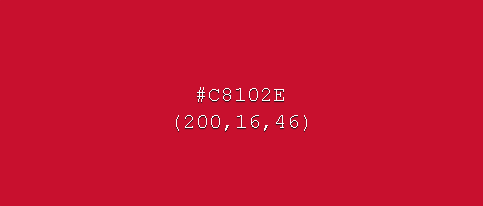
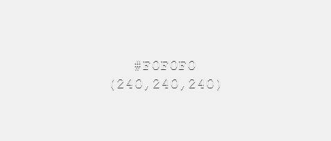
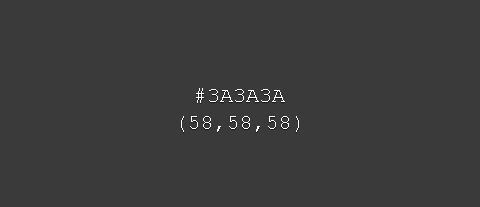
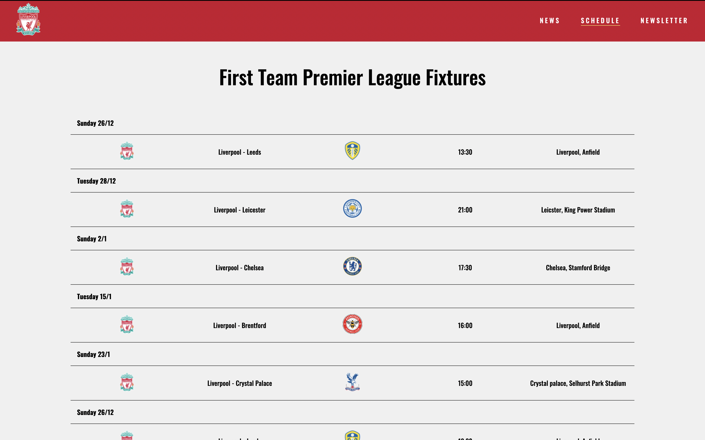
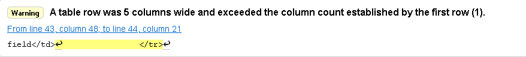

# Liverpool Fan Page

### This page is designed to make Liverpool fans lifes easier, the page is filled with the most recent news and the first teams premier league schedule. We also offer our users to sign up to our newsletter to never miss out on any news.
#

### [Link to Website](https://filipwirsen.github.io/Liverpool_fanpage/index.html)

# UX

## Stratergy
 The strategy for the page is to show everything that is relevant for a Liverpool fan to get them to sign up to the newsletter and to keep them comming back after visiting a first time.

## Scope
The website contains the following functions:

1. Show recent news articles about the first team.
2. Show the first teams premier league schedule. 
3. A form so the user can sign up and get all of our updates directly to their email. 

## Structure 
I wanted to have a very basic structure so that the user easily can navigate between the diffrent pages witch is why i made the header sticky so the alternative to view diffrent pages always is there.

## Skeleton 
When the user comes into the website they can easily see that you can either click on the articles to read the full article or use the navigation bar at the top to view the schedule or sign up to the newsletter.

## Surface 
Fontawsome was used for the social-links in the footer witch should be familiar to the user witch makes it easier to understand what the link is for.

 

# Design

## Color Scheme

### For the color scheme i wanted to go for Liverpools official colors so the colors that are used for this project are the following
#### Header and navigation background: #C8102E 

#### Body background #F0F0F0

#### Footer background is #3a3a3a

## Typography

### I used the Oswald font for everything except for the paragraphs witch has the Roboto font. I think theese two fonts complement each other very well and makes the headers pop out while the paragraphs remains easy to read.

#
## Home Page
### For the home page i wanted it to be easy to see that you can click the boxes to read the full article so i used shadowboxing and a diffrent background color.

#
## Full Article

### All of the content from the full article section are taken from [Liverpools official site](https://www.liverpoolfc.com/) and i´ve added a link to the bottom of each article witch takes the user to the real article
#
## Schedule Page

### For the Schedule page i wanted to show when, where and who were playing so i used the table attribute to add all the data i wanted per row. I also wanted to seperate the rows so the user easily can see the content that corresponds to the game they are looking at so i used the :hover selector to change the color of the whole row to Liverpools green color (#00b2a9).

#

## Newsletter Page

### For the newsletter page i wanted to have the form as the only content to make the users focus stay on signing up witch is why i used the min-width property to always make the newsletter page cover the whole screen.

# Error and Validation
### All pages were validated using [w3.org](https://jigsaw.w3.org/css-validator/validator) for CSS and [w3.org](https://validator.w3.org/nu/) for HTML

 When validating the schedule page i got the following warning 

 I fixed this by adding the colspan attribute to the table header

 When uploading the project to github i the background picture on the newsletter page didnt load, I fixed this by changing the url path.

# Languages used 

[HTML](https://sv.wikipedia.org/wiki/HTML)

[CSS](https://sv.wikipedia.org/wiki/CSS)

# Deployment

# Credits 

### Alot of my images and all of the content in the articles are taken from [Liverpools Official site](https://www.liverpoolfc.com/)
### To add shadowboxing to the home page i used [getcssscan](https://getcssscan.com/css-box-shadow-examples)