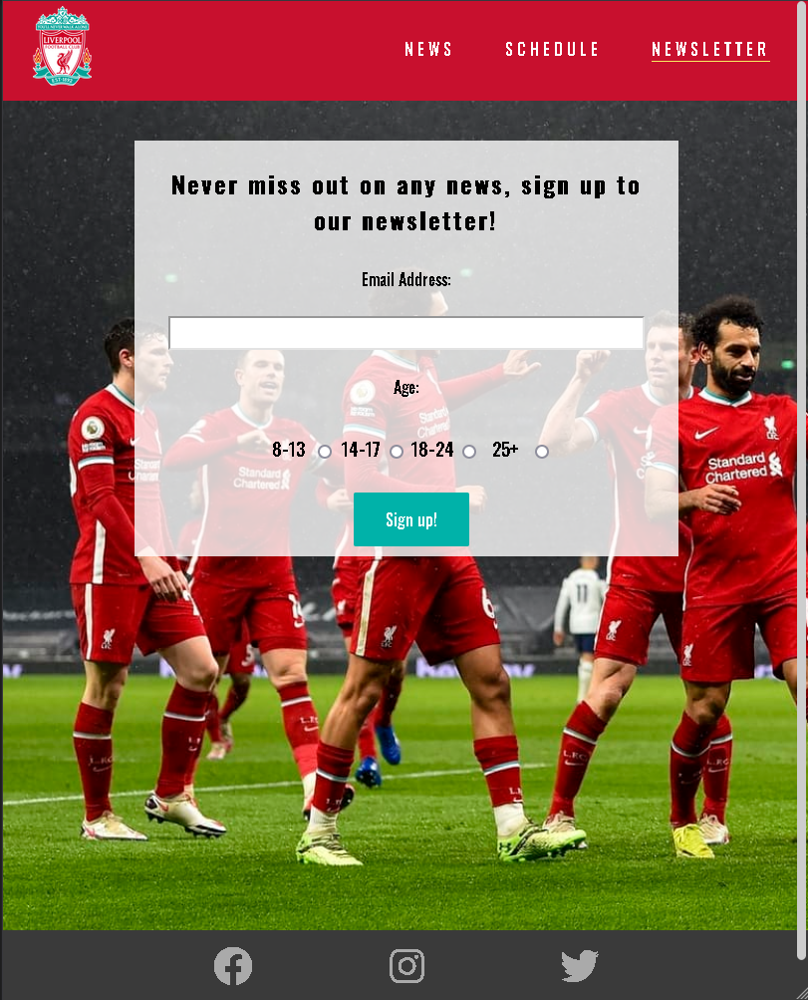

# Liverpool Fan Page
 This page is designed to make Liverpool fans lifes easier, the page is filled with the most recent news and the first teams premier league schedule. We also offer our users to sign up to our newsletter to never miss out on any news. Alot of fotboll fans that i know have to visit diffrent sites to view their favorite teams fixtures and news. With this page you get all the information you need about Liverpool. When your visiting the site for the first time you will be greeted by familiar colors and instantly see the latest news and have to option to see the fixtures. There is no longer a need to visit diffrent pages to get all of the relevant information and that is why the users will be comming back to the site.
#

#### [Link to Website](https://filipwirsen.github.io/Liverpool_fanpage/index.html)

# UX 

## User Stories
As a user i want to look at Liverpools fixtures and the most recent news. Since this site has all of the relevant news and shows the premier league fixtures i dont need to go to any other sites to get all of the information i need to be a huge Liverpool fan.

## Client Goals
* To be able to find all the relevant information on one site.
* To be able to view the site on any device without it being a different UX
* To allow people to sign up to a newsletter to get notified about recent news

## First Time Visitor Goals
* Find interesting and new articles regarding Liverpool
* Find the teams fixtures

## Returning visitor Goals
* Make users sign up to the newsletter so they get a notification about new articles on the site
* Make it a standard for them to visit the site whenever they want to know anything about the team news or their fixtures  

## Stratergy
 * The strategy for the page is to show everything that is relevant for a Liverpool fan to get them to sign up to the newsletter and to keep them comming back after visiting a first time.

## Scope
* The website contains the following functions:

1. Show recent news articles about the first team.
2. Show the first teams premier league schedule. 
3. A form so the user can sign up and get notified via email when we release new updates. 

## Structure 
* I wanted to have a very basic structure so that the user easily can   navigate between the diffrent pages witch is why i made the header sticky so the alternative to view diffrent pages always is there.

## Skeleton 
* When the user comes into the website they can easily see that you can either click on the articles to read the full article or use the navigation bar at the top to view the schedule or sign up to the newsletter.

## Surface 
* Fontawsome was used for the social-links in the footer witch should be familiar to the user witch makes it easier to understand what the link is for.

 

# Design

## Color Scheme

For the color scheme i wanted to go for Liverpools official colors so the colors that are used for this project are the following

 * Header and navigation background: #C8102E 

 
 * Body background #F0F0F0

* Footer background is #3a3a3a

## Typography
I used the Oswald font for everything except for the paragraphs witch has the Roboto font. I think theese two fonts complement each other very well and makes the headers pop out while the paragraphs remains easy to read.
#
## Imagery
All team logos are taken from the Premier leagues own website and the other images are taken from Liverpools site.
* [Premier League](https://www.premierleague.com/)
* [Liverpools official site](https://www.liverpoolfc.com/)  
#
## Home Page
For the home page i wanted it to be easy to see that you can click the boxes to read the full article so i used box-shadowing and a diffrent background color for the articles. The header is build with a logo that directs the user to the home page and three diffrent links to navigate through the site.

#
## Full Article
All of the content from the full article section are taken from [Liverpools official site](https://www.liverpoolfc.com/) and i´ve added a link to the bottom of each article witch takes the user to the real article. To make it easy and fast to navigate i made the header sticky so even if your at the bottom of the page you can still navigate through the site.

#
## Schedule Page
For the Schedule page i wanted to show when, where and who were playing so i used the table attribute to add all the data i wanted per row. I also wanted to seperate the rows so the user easily can see the content that corresponds to the game they are looking at so i used the :hover selector to change the color of the whole row to Liverpools green color (#00b2a9).

#

## Newsletter Page
For the newsletter page i wanted to have the form as the only content to make the users focus stay on signing up witch is why i used the min-width property to always make the newsletter page cover the whole screen.

# Error and Validation
All pages were validated using [w3.org](https://jigsaw.w3.org/css-validator/validator) for CSS and [w3.org](https://validator.w3.org/nu/) for HTML

When validating the schedule page i got the following warning 

 I fixed this by adding the colspan attribute to the table header

 When uploading the project to github the background picture on the newsletter page didnt load, I fixed this by changing the url path.

# Technologies Used

* [HTML](https://sv.wikipedia.org/wiki/HTML) - To build the site
* [CSS](https://sv.wikipedia.org/wiki/CSS) - To style the site
* [FontAwsome](https://fontawesome.com/) - To use familiar logos for social links.
* [Google Fonts](https://fonts.google.com/) - To import fonts used on the website.
* [Google Dev Tools](https://developer.chrome.com/docs/devtools/) -  To  test features, solve issues with styling and responsiveness. 

# Deployment

## Initial Deployment
I used Github Pages to deploy the live website i did it using the instructions below:
1. Sign up or log in to Github.
2. Find the repository for the project you want to deploy.
3. Click on "Settings".
4. Click on "Pages" in the left navigation bar.
5. Under the "Source" section, press the drop down menu and select "Root".
6. Click Save. Your site is now deployed at the URL shown.

# Credits 

1. Alot of my images and all of the content in the articles are taken from [Liverpools Official site](https://www.liverpoolfc.com/)
2. All team logos are taken from [Premier Leagues site](https://www.premierleague.com/)
3. To add shadowboxing to the home page i used [getcssscan](https://getcssscan.com/css-box-shadow-examples)
4. To add the icons for the social links in the footer i used [Font Awsome](https://fontawesome.com/)
